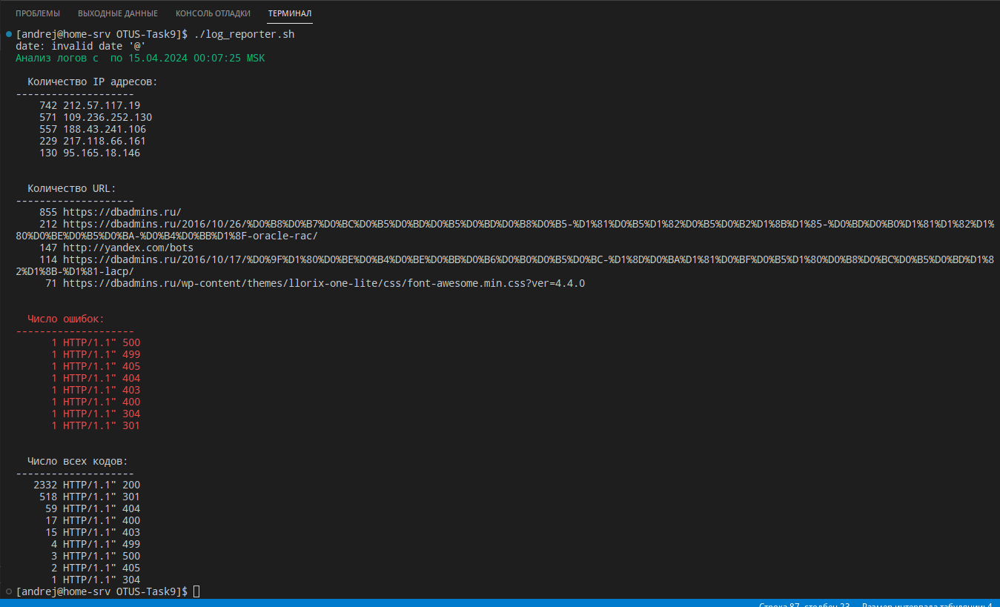

# ДОМАШНЕЕ ЗАДАНИЕ: написать скрипт на языке Bash;
Написать скрипт для CRON, который раз в час будет формировать письмо и отправлять на заданную почту.

Необходимая информация в письме:

Список IP адресов (с наибольшим кол-вом запросов) с указанием кол-ва запросов c момента последнего запуска скрипта;
Список запрашиваемых URL (с наибольшим кол-вом запросов) с указанием кол-ва запросов c момента последнего запуска скрипта;
Ошибки веб-сервера/приложения c момента последнего запуска;
Список всех кодов HTTP ответа с указанием их кол-ва с момента последнего запуска скрипта.
Скрипт должен предотвращать одновременный запуск нескольких копий, до его завершения.

В письме должен быть прописан обрабатываемый временной диапазон.

---
## Решение:

Скрипт берёт основные параметры из файла log_reporter.conf

Комментарии по работе скрипта приведены в самом скрипте.

Скрипт реализован таким образов, что при выполнеии выборки из файла логов запускается 3 параллельных процесса.
В теле скрипта стоят ловушки сигналов выхода чтобы удалить файл блокировки в случае завершеня скрипта с ошибкой.
Сообщение, которое отправялется на почту, выводится в консоль.
Файл с логами для теста был найден в интернете.

Текст скрипта:

```bash
#!/bin/bash

# Прочитаем переменные из файла конфигурации
source log_reporter.conf

# Чтобы узнать, когда скрипт запускался последний раз, будем использовать файл "logreporter.time", куда будем записывать текущее время в секундах, прошедших с 01/01/1970
LAST_TIME_FILE="logreporter.time"
#Создаём временные файлы
REPORT_FILE=$(mktemp)
MAIL_FILE=$(mktemp)
TMP_RESULT_FILE=$(mktemp)

# Чтобы скрипт нельзя было запустить одновременно дважды, будем использовать файл "logreporter.lock"
LOGREPORTER_LOCK_FILE="logreporter.lock"
# Результат работы скрипта будем собирать во временный файл, созданный с помощью команды mktemp
#LOGREPORTER_RESULT_FILE=$(mktemp)
#TMP_RESULT_FILE=$(mktemp)


###################
#     ФУНКЦИИ     #
###################

# Функция записывает текущее время, т.е. время запуска скрипта в файл
function update_last_time_file {
	date +%s > "$LAST_TIME_FILE"
}

# Функция проверяет, что файл "logreporter.time" существует и получает значение из него, либо создаёт этот файл и записывает в него значение
function get_last_time {
	[ -f "$LAST_TIME_FILE" ];  cat "$LAST_TIME_FILE" 2>/dev/null|| update_last_time_file
}

# Функция выбирает из файла лога нужную часть для анализа и сохраняет его во временный файл, их которого потом другие функции будут выбирать нужные данные.
# В функциях, которые собирают нужные данные из лога, работают параллельно для повышения быстродействия.
function select_part_of_log {

	cat logfiles/access.log \
    | grep -E -o '[0-9]{,2}/[A-Z][a-z][a-z]/[0-9][0-9][0-9][0-9]:[0-9][0-9]:[0-9][0-9]:[0-9][0-9]'\
    | sed 's_/_ _g' | sed 's/:/ /' \
    | while read -r line; do date -d "$line" "+%s"; done \
    | while read -r line; do [[ $line -gt $LAST_TIME ]] && echo $line; done \
    | while read -r line; do LANG=en_EN date --date @$line +"%d/%b/%Y:%H:%M:%S"; done \
    | while read -r line; do grep $line logfiles/access.log; done > $TMP_RESULT_FILE

}

# Функция анализирует логи и выбирает IP с наибольшим числом запросов 
function create_ip_report {

   ( grep -E -o "(25[0-5]|2[0-4][0-9]|[01]?[0-9][0-9]?)\.(25[0-5]|2[0-4][0-9]|[01]?[0-9][0-9]?)\.(25[0-5]|2[0-4][0-9]|[01]?[0-9][0-9]?)\.(25[0-5]|2[0-4][0-9]|[01]?[0-9][0-9]?)" $TMP_RESULT_FILE \
    | sort | uniq -c | sort -n -r | head -"$IP_TOP_COUNT" > "$REP_IP" ) & PID_IP=$!

}

#Функция анализирует логи и выбирает URL с наибольшим числом запросов 
function create_url_report {
  ( grep -E -o '(https?|ftp|file)://[-[:alnum:]\+&@#/%?=~_|!:,.;]*[-[:alnum:]\+&@#/%=~_|]' $TMP_RESULT_FILE \
  | sort | uniq -c | sort -n -r | head  -"$URL_TOP_COUNT" > "$REP_URL" ) & PID_URL=$!
}

# функция собирает все коды ответа, сохраняет во врмеменный файл, а из него получает коды ошибок 3**, 4**, 5**
function create_errors_report {

( grep -E -o 'HTTP/1.1" [1-5][0-9][0-9]' $TMP_RESULT_FILE \
 | sort | uniq -c | sort -n -r | head > "$REP_CODE" 
 
   cat $REP_CODE | grep -E -o 'HTTP/1.1" [3-5][0-9][0-9]' \
 | sort | uniq -c | sort -n -r | head >> "$REP_CODE_ERRORS" 

 ) & PID_CODE=$!

}

#Функция собирает текст сообщения
function create_report {
	true > "$REPORT_FILE"
	REP_START_DATE=$(LANG=en_EN date -d "@${LAST_TIME}" "+%d.%m.%Y %H:%M:%S %Z")
	REP_END_DATE=$(LANG=en_EN date "+%d.%m.%Y %H:%M:%S %Z")

	{
		echo -e "\033[32mАнализ логов с $REP_START_DATE по $REP_END_DATE\n\n\033[0m  Количество IP адресов:\n--------------------"
		cat "$REP_IP" 
		tput sgr0
		
		echo -e "\n\n  Количество URL:\n--------------------"
		cat "$REP_URL"

		echo -e "\033[91m\n\n  Число ошибок:\n--------------------"
		cat "$REP_CODE_ERRORS"

		echo -e "\033[0m\n\n  Число всех кодов:\n--------------------"
		cat "$REP_CODE"

	} >> "$REPORT_FILE"
	cat "$REPORT_FILE"
}

#Функция отправляет письмо на почту, указанную в файле log_reporter.conf
function send_report {

	cat "$REPORT_FILE" | mail -s "Анализ логов с $REP_START_DATE по $REP_END_DATE" "$EMAIL"
}

# Функия очищает созданные временные файлы
function clean_temp {
	for tmp_file in "$MAIL_FILE" \
					"$TMP_RESULT_FILE" \
	                "$FIFO_IP" "$REP_IP" \
	                "$FIFO_URL" "$REP_URL" \
	                "$FIFO_CODE" "$REP_CODE" "$REP_CODE_ERRORS" \
	                "$REPORT_FILE"; do
		rm -f "$tmp_file";
	done;
}

########################
#     ОСНОВНОЙ КОД     #
########################

# Если переменная $LAST_TIME пуста, то получаем это значение вызвав функцию "get_last_time"  
if [[ -z "$LAST_TIME" ]]; then
   LAST_TIME=$(get_last_time)
fi

#Если LOGREPORTER_LOCK_FILE не существует, то создаём его, записываем в него PID текущего процесса и включаем ловушку сигнала завершения
if [ ! -f "$LOGREPORTER_LOCK_FILE" ]; then 
	echo "$$" > "$LOGREPORTER_LOCK_FILE"
	trap 'rm -f "${LOGREPORTER_LOCK_FILE}"; exit $?' INT TERM EXIT

    # Получаем имена временных файлов, но не создём их. Далее с такими именами сделаем именованные каналы.
	FIFO_IP=$(mktemp -u)
	FIFO_URL=$(mktemp -u)
	FIFO_CODE=$(mktemp -u)

    # Создаём файлы именованных каналов
	mkfifo "$FIFO_IP" "$FIFO_URL" "$FIFO_CODE" 

    # Создаём временные файлы
	REP_IP=$(mktemp)
	REP_URL=$(mktemp)
	REP_CODE=$(mktemp)
	REP_CODE_ERRORS=$(mktemp)

    # Вызываем функции 
	select_part_of_log    # Выборка из лога за нужное время
	create_ip_report      # Выбор IP
	create_url_report     # Выбор URL
	create_errors_report  # Выбор ошибок и кодов возврата
	create_errors_report

    # Ожидаем завершения процессов, которые запускаются в функциях-анализаторах логов
	wait $PID_IP $PID_URL $PID_CODE

	create_report # вызываем функцию, которая соберёт сообщение
	send_report  # вызываем функцию, которая отправит сообщение
	update_last_time_file # вызываем функцию, которая обновит время в файле "logreporter.time"

    # Очищаем временные файлы, созданные при работе скрипта
	clean_temp

	trap - INT TERM EXIT #Отключаем ловушку для сигнала завершения
	rm -f "$LOGREPORTER_LOCK_FILE"  #Удаляем файл "logreporter.lock"

else #иначе получаем PID процесса и сообщаем, что скипт уже запущен
	PID=$(cat $LOGREPORTER_LOCK_FILE)
	echo "Скрипт уже работает (его PID: ${PID})"
fi
```

Результат работы:
